#  WPF编程

[TOC]


## WPF介绍

WPF（Windows Presentation Foundation）是微软推出的基于Windows的用户界面框架，它是.NET Framework 3.0的一部分。以下是关于WPF的详细介绍：

1. **编程模型与界面设计**：WPF为开发人员和界面设计人员提供了统一的编程模型、语言和框架，使得两者的工作可以真正分离。它支持基于XAML（可扩展应用程序标记语言）和.NET编程模型的方式来创建用户界面，实现了代码和标记的分离，为开发者带来了极大的便利。
2. **多媒体交互与视觉效果**：WPF提供了全新的多媒体交互用户图形界面，支持丰富的视觉、动画和多媒体效果，使应用程序具有更高的吸引力和交互性。
3. **控件与数据绑定**：WPF中包含了用于构建用户界面的基本元素，如Button、TextBox等控件。同时，它支持数据绑定功能，可以将数据源与界面元素进行绑定，实现数据的动态显示和更新。
4. **分辨率无关与矢量呈现**：WPF的核心是一个与分辨率无关且基于矢量的呈现引擎，旨在充分利用现代图形硬件，为应用程序提供高清晰度、高质量的视觉体验。
5. **全球化与本地化**：WPF应用程序的全球化和本地化得以简化，使得应用程序能够更好地适应不同语言和地区的用户需求。

总的来说，WPF是一个功能强大、灵活且易于使用的用户界面框架，它使得开发者能够创建出具有丰富视觉效果和交互性的Windows桌面应用程序。同时，它也为开发人员和界面设计人员提供了更好的协作方式，提高了开发效率和质量。

### 项目文件和目录结构

### 文件类型

WPF（Windows Presentation Foundation）工程文件目录中包含多种类型的文件，每种文件都有其特定的作用。以下是一些主要文件和它们的作用：

1. 项目文件（.csproj 或 .vbproj）
   - **作用**：这个文件定义了项目的结构和属性，包含了项目所依赖的库、文件、资源等的引用。
   - **内容**：通常包含了项目类型GUID、程序集名称、版本信息、编译选项等，以及项目包含的文件列表和依赖关系。
2. 程序入口文件（App.xaml 和 App.xaml.cs）
   - **作用**：定义了WPF应用程序的启动行为和应用程序级别的资源。
   - **内容**：`App.xaml` 是XAML标记文件，定义了应用程序的资源字典和其他设置；`App.xaml.cs`是对应的C#代码文件，包含了应用程序的启动逻辑。
3. 主窗口文件（MainWindow.xaml 和 MainWindow.xaml.cs）
   - **作用**：定义了应用程序的主窗口界面及其后台逻辑。
   - **内容**：`MainWindow.xaml`是XAML标记文件，定义了窗口的布局和外观；`MainWindow.xaml.cs` 是对应的C#代码文件，包含了窗口的事件处理和其他逻辑。
4. 用户控件文件（UserControl.xaml 和 UserControl.xaml.cs）
   - **作用**：定义了可重用的自定义控件。
   - **内容**：与主窗口文件类似，但用于创建可复用的UI组件。
5. 资源文件（如图片、样式、字体等）
   - **作用**：存放项目所需的图片、图标、样式表等静态资源。
   - **内容**：通常是图像文件（.png, .jpg等）、XAML资源字典（用于存储样式、模板等）或其他类型文件。
6. 程序集引用（.dll 文件）
   - **作用**：包含了项目所依赖的其他库或框架。
   - **内容**：这些通常是.NET Framework的组件、第三方库或其他项目的输出。
7. 配置文件（如app.config）
   - **作用**：用于存储应用程序的配置信息，如连接字符串、设置等。
   - **内容**：包含了应用程序的配置数据，可以在运行时读取。
8. 代码文件（.cs 或 .vb）
   - **作用**：包含应用程序的业务逻辑和数据处理代码。
   - **内容**：C#或VB.NET编写的类、方法、属性等。
9. 其他文件
   - 可能还包括测试文件、文档文件、项目模板文件等，具体取决于项目的规模和需求。

在Visual Studio等IDE中，这些文件通常会被组织在不同的文件夹和解决方案资源管理器中，以便于开发和管理。开发者可以根据需要添加、删除或修改这些文件，以满足项目的特定要求。

### 目录结构

当然可以，以下是对WPF工程文件目录中的`Properties`、`References`、`App.xaml`、`App.config`和`MainWindow.xaml`分支及其包含文件的详细解释：

- **Properties**
  - **包含的文件**：通常包含项目的元数据、配置设置和资源文件。
  - **作用**：
    - **元数据****：存储程序集的元数据，如标题、描述、版本信息等，这些信息通常用于程序的属性窗口或安装程序中。
    - **配置设置****：包含项目的编译选项、生成事件等配置信息。
    - **资源文件**：如图标、图片、字符串等静态资源，这些资源可以在项目中被引用和使用。

- **References**
  - **包含的文件**：项目的引用列表，指向项目所依赖的其他库或组件。
  - **作用**：
    - **依赖管理**：列出了项目所需的外部库或框架，确保这些依赖在编译和运行时能够被正确加载。
    - **类型引用**：允许项目中的代码引用和使用这些外部库中的类型和方法。

- **App.xaml**

  - **包含的文件**：XAML标记文件，定义了应用程序的启动行为和全局资源。

  - **作用**：

    - **启动逻辑**：指定应用程序的启动行为，如启动窗口、初始化事件等。

    - **全局资源**：定义应用程序级别的资源，如样式、模板和全局变量，这些资源可以在整个应用程序中被引用和使用。

- **App.xaml.cs**

  - **包含的文件**：与`App.xaml`对应的C#代码文件，包含应用程序的后台逻辑。

  - **作用**：
    - **事件处理**：处理与应用程序启动和关闭相关的事件。
    - **代码逻辑**：实现应用程序级别的逻辑，如配置初始化、资源加载等。

- **App.config**

  - **包含的文件**：应用程序的配置文件，用于存储应用程序的运行时配置信息。

  - **作用**：

    - **配置存储**：存储应用程序的运行时配置，如数据库连接字符串、API密钥等。

    - **灵活性**：允许在不修改代码的情况下，通过修改配置文件来改变应用程序的行为。

- **MainWindow.xaml**

  - **包含的文件**：XAML标记文件，定义了应用程序主窗口的用户界面。

  - **作用**：
    - **界面设计**：描述主窗口的布局、控件和外观。
    - **属性设置**：设置窗口的属性，如标题、大小、图标等。

- **MainWindow.xaml.cs**

  - **包含的文件**：与`MainWindow.xaml`对应的C#代码文件，包含主窗口的后台逻辑。

  - **作用**：

    - **事件处理**：处理与用户界面交互相关的事件，如按钮点击、文本框输入等。

    - **业务逻辑**：实现与主窗口相关的业务逻辑。

## XAML

xaml全称可扩展应用程序标记语言，是wpf技术中专门用于设计UI界面的语言

- XAML 可以设计出专业的 UI 和动画
- XAML 不需要专业的编程知识，它简单易懂、结构清晰
- XAML 使设计师能直接参与软件开发，随时沟通、无需二次转化效率高
- 实现了UI和逻辑的剥离

> c#使用不同的命令可以编译出不同的结果
>
> - 使用`/t:exe`->命令行程序（Console Application）
> - 使用`/t:winexe`-->图形用户界面程序（GUI Application）
> - 使用`/t:library`-->动态链接库（Dynamic Link Library,DLL）

### MainWindow.xaml

MainWindow.xaml的代码会被编译为`x:Class="MFirstWpfApp.MainWindow"`中对应的`MainWindow.cs`类，并在类前面加上`partial`访问修饰符。并和c#代码中的`partial`修饰的类合并为一个类，最终实现类视图层和逻辑层的合二为一。

```xaml
<Window x:Class="MFirstWpfApp.MainWindow"
        // 默认命名空间——无前缀（表现层的程序集）,默认命名空只能有一个
        xmlns="http://schemas.microsoft.com/winfx/2006/xaml/presentation"  
        // 命名空间x(语言层的程序集)
        xmlns:x="http://schemas.microsoft.com/winfx/2006/xaml"
        xmlns:d="http://schemas.microsoft.com/expression/blend/2008"
        xmlns:mc="http://schemas.openxmlformats.org/markup-compatibility/2006"
        xmlns:local="clr-namespace:MFirstWpfApp"
        mc:Ignorable="d"
        Title="MainWindow" Height="450" Width="800">
    <Grid>
        
    </Grid>
</Window>
```

### 特性Attribute

```xaml
非空标签 <Tag Attribute1="" Attribute2="">内容</Tag>
空标签	<Tag Attribute1="" Attribute2=""/>
```

特性Attribute和属性Property

Attribute属于语言层面，为了“区分“每个元素的不同。

Property属于对象层面，在类中表示事物状态的成员。

Attribute和Property并不是完全对应，一个元素所包含的Attribute多于它所代表的Property

**使用Attribute为对象属性赋值**

`Rectangle`类中有一个父类继承的 `Public Brush Fill`属性

```xaml
<Window x:Class="MFirstWpfApp.MainWindow"
        xmlns="http://schemas.microsoft.com/winfx/2006/xaml/presentation"
        xmlns:x="http://schemas.microsoft.com/winfx/2006/xaml"
        xmlns:d="http://schemas.microsoft.com/expression/blend/2008"
        xmlns:mc="http://schemas.openxmlformats.org/markup-compatibility/2006"
        xmlns:local="clr-namespace:MFirstWpfApp"
        mc:Ignorable="d"
        Title="MainWindow" Height="450" Width="800">
    <Grid>
        <Rectangle x:Name="rectName" Width="100" Height="150" Fill="Azure" />
    </Grid>
</Window>
```

使用`Attribute = Value`的语法赋值，但是`Value`的值只能是**字符串**，所以会出现两个问题：

1. 一个类能使用`Xaml`语言进行声明，并且Property与Attribute有映射关系，那么这些Property则需要有转换机制。--解决方法：使用TypeConverter类的派生类重写一些方法
2. 没有代码辅助的情况下，需要手写格式复杂的字符串满足赋值要求----解决方法:使用**属性元素**

**使用TypeConverter类**

```c#
  internal class Human
  {
      public string Name { get; set; }
      public Human Children { get; set; }
  }
```

```xaml
<Window.Resources>
    <local:Human x:Key="human" Name="human"  Children="AAA"/>
</Window.Resources>
```

```c#
private void Button_Click(object sender, RoutedEventArgs e)
{
    Human h = this.FindResource("human") as Human;
    MessageBox.Show(h.Children.Name);
}
```

`Human`类的`Children`属性是`Human`类型，此时`Children=“AAA”`的value是一个字符串,所以点击按钮时会报错：

```
ArgumentException: 类型“System.String”的对象无法转换为类型“MFirstWpfApp.Human”
```

优化过程

`StringToHumanTypeConverter`类实现了`TypeConverter`类并且重写`ConvertFrom`方法

```c#
 internal class StringToHumanTypeConverter : TypeConverter
 {
     /// <summary>
     /// 重写方法
     /// </summary>
     public override object ConvertFrom(ITypeDescriptorContext context, CultureInfo culture, object value)
     {
         if (value is String)
         {
             Human human = new  Human();
             human.Name = value as String;
             return human;
         }
         
         return base.ConvertFrom(context, culture, value);
     }
 }
```

在`Human`类的上方加上注解`TypeConverterAttribute`,也可简写为``TypeConverter`

```c#
[TypeConverterAttribute(typeof(StringToHumanTypeConverter))]
internal class Human
{
    public string Name { get; set; }
    public Human Children { get; set; }
}
```

此时即可成功运行

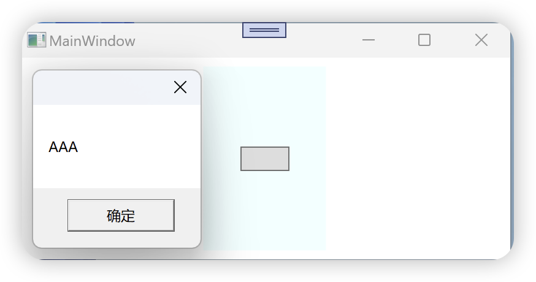


### **使用属性元素对象属性赋值**

每一个非空标签都有自己的子集标签，属性元素指的是某个标签的一个元素对应这个标签的一个属性，以元素的形式来表达一个实例的属性。语法如下：

```xaml
 <ClassName>
     <ClassName.PropertyName>
         <!-- 以对象的形式为属性赋值-->
     </ClassName.PropertyName>
 </ClassName>
```

```c#
// 使用Attribute = Value的形式
<Rectangle x:Name="rectName" Width="100" Height="150" Fill="Azure" />  

// 使用属性元素的形式
<Rectangle x:Name="rectName" Width="100" Height="150" >
      <Rectangle.Fill>
          <SolidColorBrush Color="Beige"/>
      </Rectangle.Fill>
</Rectangle>
```

属性元素一般用于复杂的对象进行描述会比较有优势。

- 能使用`Attribute = Value`的形式就优先使用
- 充分利用默认值去除冗余，默认值可以省略
- 某些内容是集合类元素的标签，可以省略写集合直接写集合内容

### **标记扩展**

标记扩展是一种特殊的`Attribute = Value`语法，将`value`的字符串形式使用`{}`包裹，通过XMAL的解析，将内容生成相应的对象 。

```xaml
<StackPanel>
  	<!--TextBox的Text属性绑定到Slider滑块的Value上-->
    <TextBox  Text="{Binding ElementName=slider1,Path=Value,Mode=OneWay}" Margin="3" />
    <Slider x:Name="silder1" Margin ="4"/>
</StackPanel>


// 使用属性标签来替换标记扩展
<StackPanel>
  	<!--TextBox的Text属性绑定到Slider滑块的Value上-->
    <TextBox  Margin="3">
 			<TextBox.Text>
         <Binding ElementName=slider1 Path=Value Mode=OneWay/>
      </TextBox.Text>
  	</TextBox>
    <Slider x:Name="silder1" Margin ="4"/>
</StackPanel>
```

注意，并非所有的对象都能使用标记扩展的语法来表达，只有`MarkupExtension`类的派生类才适用。

代码中使用对象初始化的语法创建binding实例:

```c#
Binding binding = new Binding()
{
  Source = slider1,
  Mode = BindingMode.OneWay
};
```

标记扩展可以使用嵌套

```c#
 <TextBox  Text="{Binding Source={StaticResource myDataSource},Path = PersonName}" Margin="3" />
```

扩展标记有简写的语法

- 标记扩展的类名以`Extension`为后缀，在`Xaml`中可以省略不写

```xaml
Text = "{x:Static ...} 等价于 Text = "{x:StaticExtension ...}"
```

- 使用固定位置参数和具名参数

```xaml
{Binding Value,...} 等价 {Binding Path = Value} //固定位置参数(构造器传参)

{StaticResorce myString,...} 等价 {StaticResorce ResourceKey = myString,...} // 指定ResourceKey的值
```

### 导入程序集和引用其中的命名空间

Xaml中引入命名空间的语法：

```xaml
 xmlns:映射名="clr-namespace:类库中命名空间的名字;assembly=类库文件名"

例如：
 xmlns:common="clr-namespace:Common;assembly=Mylibrary"
```

- `xmlns`是`XMLNameSpace`的缩写
- 映射名是可选的，如果不写则为默认命名空间，默认命名空间只能有一个。建议映射名是命名空间的原名或者是其缩写，相当与C#代码中的`using Cmm = Common`取一个别名
- 引号中的字符串代表引用哪个类库和类库中的哪个命名空间

引入命名空间里的类，当需要使用时候的语法格式:

```xaml
<映射名:类名>...</映射名:类名>

例如：
<common:MessagePanl x:Name = "WindowOne"/>
```

Xaml中的注释

```xaml
<!-- 注释内容 -->
```

### x命名空间

`x`是`xaml`的简写，该命名空间中包含了对`Xaml`语言相关的类

`x`命名空间下的工具可以分为三大类：

|  名称   |     种类     |
| :-----: | :----------: |
| x:Array |   标签扩展   |
| x:Code  | XAML指令元素 |
| x:Name  |  Attribute   |
|  ....   |     ...      |

#### x:Class

告诉`Xaml`编译器将`xaml`编译的结果和指定的类进行合并

- 该属性只能用于根节点
- `x:Class`的根节点的类型要与`x:Class`指定的类型一致
- `x:Class`所指的类的修饰符中必须有`partial`关键字

#### x:ClassModifier

告诉`Xaml`编译器由标签生成的类的访问级别

- 前提是必须有`x:Class`
- 访问级别与`x:Class`指向的类的访问级别相同
- `x:ClassModifier`的值随后台代码编译的语言不同而不同，参见`System.Reflection.TypeAttributes`枚举

#### x:Name

- 告诉编译器，对具有x:Name属性的标签生成对应的实例的同时还为这个实例声明了一个引用的变量，变量名是x:Name的值

- 将xaml标签所对应的Name属性（如果存在）设为x:Name的值，并把这个值注册到UI树中

  - ```xaml
    <Button Name="Btn" Content="按钮"/>
    
    // xaml编译器会将Btn作为x:Name的值
    ```

  - Name和x:Name不能同时存在一个标签中

- 统一使用x:Name来增强对代码的统一和可读性

#### x:FieldModifier

用来修饰XAML**引用变量**的访问级别，前提是该标签也使用了`x:Name`属性

```xaml
<TextBox x:Name="t1" xFieldModifier = "public" /> // 公开
<TextBox x:Name="t2" xFieldModifier = "public" /> // 公开
<TextBox x:Name="t3"  /> // internal 程序集级别
```

#### x:Key

为资源贴上用于检索的索引，将元素放入集合，将该元素作为资源的一个条目。资源可以是重复使用的xaml内容，如Style、各种Template和动画等。

~~~xaml
<Window x:Class=".MainWindow"
 ……
 xmlns:sys="clr-namespace:System;assembly=mscorlib" // 引入字符串String
 ……
</ Window>
<!--创建一个资源条目-->
<Window.Resources>
    <sys:String x:Key="myString">"Hello world"</sys:String>
</Window.Resources>

<StackPanel x:Name="sp">
    <TextBox Text="{StaticResource myString}"  Height="30"/>
    <TextBlock Text="{StaticResource ResourceKey=myString}" Height="40"/>
</StackPanel>
~~~

代码中引入资源

```c#
String re = this.FindResource("myString") as String;
Button btn = new Button();
btn.Content = re;
sp.Children.Add(btn);
```

项目截图

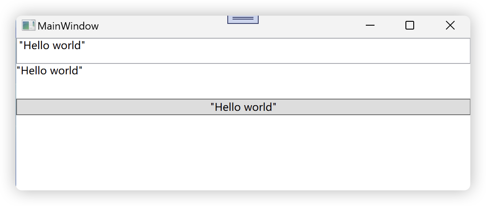

#### x:shared

x:shared配合x:key一起使用，对于字典资源来说，x:shared=true时每次检索资源得到的都是同一个对象；当x:shared=false时，每次检索字典资源都是该字典资源的一个副本。

#### x:Type

x:Type是x命名空间中的扩展标记，值为数据类型的实例或者是实例的引用，或者数据类型本身。

自定义MyButton类

```c#
public class MyButton:Button
{
    public  Type UserWinwowType {  get; set; }

    protected override void OnClick()
    {
        base.OnClick();
        Window win = Activator.CreateInstance(this.UserWinwowType) as Window;// 创建实例

        if (win != null)
        {
            win.ShowDialog();
        }
    }
}
```

新建Window1窗体，并在xaml中添加下面代码

```xaml
<StackPanel x:Name="sp">
    <TextBox Margin="5" />
    <TextBox Margin="5" />
    <TextBox Margin="5" />
    <Button Content="OK" Margin="5" />
</StackPanel>
```

在MainWindow中添加自定义的MyButton组件

```xaml
  <StackPanel>
      <local:MyButton Content="Show" UserWinwowType="{x:Type TypeName=local:Window1}" Margin="5"/>
  </StackPanel>
```

运行程序时，通过xaml配置的UserWindowType属性赋值为Window1，点击触发按钮的`OnClick`事件执行`Activator.CreateInstance(this.UserWinwowType) as Window;`创建对象，并转换为Window类型。

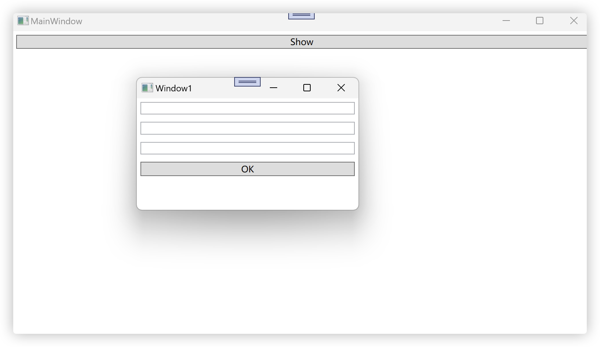

#### x:Null

这是一个扩展标记，当一个元素的属性具有默认值，但是我们又不希望使用该默认值时，可以将该属性显示的设置为null。

```xaml
<Window.Resources>
    <Style x:Key="{x:Type Button}" TargetType="{x:Type Button}" >
        <Setter Property="Width" Value="50"/>
        <Setter Property="Height" Value="30"/>
        <Setter Property="Background" Value="#FFF1CF91"/>
    </Style>
</Window.Resources>
<StackPanel>
    <Button Content="one" />
    <Button Content="two" />
    <Button Content="three" />
  	<!--下面的Button不会使用通用样式-->
    <Button Content="OK" Style="{x:Null}"/> 
</StackPanel>
```

> [!NOTE]
>
> 使用`{x:Type Button}`作为`x:Key`的值是为了创建隐式样式，该样式会自动应用于所有`Button`类型的元素。而使用字符串作为`x:Key`的值则是为了创建显式样式，需要显式引用才能应用。

运行效果

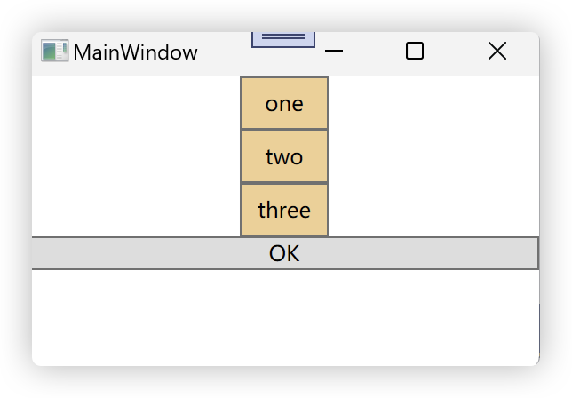

#### x:Array

x:Array作用是通过它的Items属性向使用者或者暴漏一个类型已知的ArrayList实例，ArrayList内成员的类型由x:Array的Type指明。

```xaml
 <Grid Background="LightBlue">
     <ListBox Margin="5"  ItemsSource="{x:Array Type=sys:String} Items=xxx" />
 </Grid>
```

ListBox的Items属性是只读属性，上面的方法无法添加值。

```xaml
 <Grid Background="LightBlue">
     <ListBox Margin="5" >
         <ListBox.ItemsSource>
             <x:Array Type="sys:String">
                 <sys:String>Jack</sys:String>
                 <sys:String>Jom</sys:String>
                 <sys:String>Bob</sys:String>
             </x:Array>
         </ListBox.ItemsSource>
     </ListBox>
 </Grid>
```

运行结果

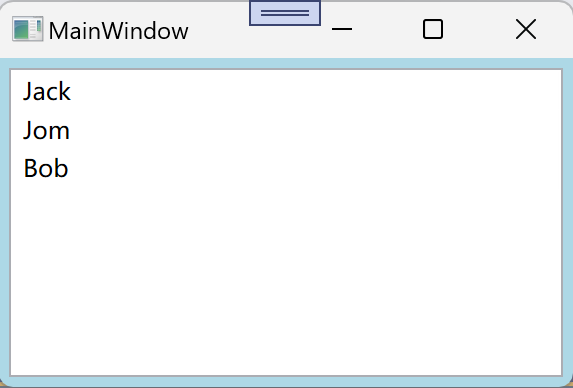

#### x:Static

这是一个扩展标记，使用x:Static来访问static静态成员（属性或字段），一般用于国际化UI设计中

```c#
public static String WindowTitle = "这是一个标题";
public static String BtnConent = "这是按钮文字";

public MainWindow()
{
    InitializeComponent();
}
```

```xaml
 
<Window x:Class="xStatic.MainWindow"
    ……
		xmlns:local="clr-namespace:xStatic"
    mc:Ignorable="d"
    Title="{x:Static local:MainWindow.WindowTitle}" Height="200" Width="300">
<Grid>
    <Button Height="40" Width="50" Content="{x:Static local:MainWindow.BtnConent}" />
</Grid>
```

运行效果

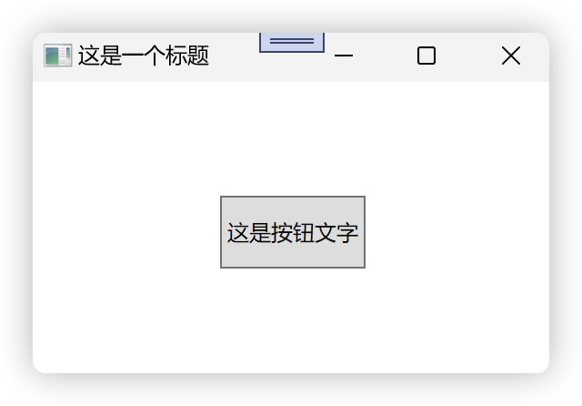

#### x:Code

这是一个指令元素，用于代码后置，在xaml中嵌入c#的代码。x:code内的代码一定要放在`<![CDATA[...]]>`这个转义标签中。

```xaml
<Button Height="40" Width="80" Content="按钮" Click="btn_click"/>
<x:Code >
    <![CDATA[
        private void btn_click(Object sender,RoutedEventArgs e)
        {
            MessageBox.Show("Hello x:code");
        }
    ]]>
</x:Code>
```

#### x:XData

这是一个指令标签，用于放置数据提供者的实例。

```xaml
<Window.Resources>
    <XmlDataProvider x:Key="XmlData" XPath="Books/Book">
        <x:XData>
            <![CDATA[
                <Books>
                    <Book Title="WPF编程宝典" Author="张三" />
                    <Book Title="深入浅出WPF" Author="李四" />
                    <!-- 更多书籍信息 -->
                </Books>
            ]]>
        </x:XData>
    </XmlDataProvider>
</Window.Resources>

<ListBox ItemsSource="{Binding Source={StaticResource XmlData}}" DisplayMemberPath="Title" />
```

## 控件与布局

WPF的UI元素的类型

| 名称                   | 注释                           |
| ---------------------- | ------------------------------ |
| ContentControl         | 単一内容控件                   |
| HeaderedContentControl | 带标题的单一内容控件           |
| ItemsControl           | 以条日集合为内容的控件         |
| HeaderedItemsControl   | 带标题的以条日集合为内容的控件 |
| Decorator              | 控件装饰元素                   |
| Panel                  | 面板类元素                     |
| Adorner                | 文字点缀元素                   |
| Flow Text              | 流式文本元素                   |
| TextBox                | 文本輸入框                     |
| TextBlock              | 静态文字                       |
| Shape                  | 图形元素（非控件）             |

**逻辑树**（Logical Tree）是一个表示用户界面元素（UI元素）之间逻辑关系的树状结构。它与视觉树（Visual Tree）不同，视觉树包含了所有的视觉元素，包括那些不由XAML直接定义的元素。逻辑树只包含在XAML中定义的元素，以及那些通过代码添加到容器中的元素。

**内容元素**都有Content或者Child，集合类的内容控件有Items或Children。控件的内容就是其Content，下面的代码等价

```xaml
<Button Content="按钮" />
```

```xaml
<Button>
	<Button.Content>
  	<sys:String>按钮</sys:String>
  </Button.Content>
</Button>
```

```xaml
<button>
	<sys:String>按钮</sys:String>
</button>
```

同理Content是集合类的比如`StackPanel`控件,下面的两组代码等价：

```xaml
<StackPanel>
	<TextBox Text="A"/>
	<TextBox Text="B"/>
	<TextBox Text="C"/>
</StackPanel>
```

```xaml
<StackPanel>
    <StackPanel.Children>
      <TextBox Text="A"/>
      <TextBox Text="B"/>
      <TextBox Text="C"/>
    </StackPanel.Children>
</StackPanel>
```


### ControlControl族

- 派生自ControlControl类
- 只能由一个元素来填充内容。
- 内容属性名为Content

下面是报错的代码，`错误XDG0040Content”只能设置一次。`,因为Button空间属于单一内容控件，只能放一个元素。若想放多个控件，可以使用能包含多个内容的控件将多个元素包裹，在放入单一内容控件中。

```xaml
<Button Width="60" Height="40" >
    <TextBox Text="这是控件1" />
    <Image Source="./a.png" Width="30" Height="30" />
</Button>
```

### HeaderedContentControl族

- 派生自ControlControl类
- 带有标题和内容区域

- 有Header和Content作为内容属性
- Content和Header都只能使用一个控件作为其内容

```xaml
<GroupBox Margin="5" >
    <GroupBox.Header>
        <TextBox Text="这是一个标题" />
    </GroupBox.Header>
    <TextBlock Text="这是内容区域" />
</GroupBox>
```

### ItemsControl族

- 派生自ItemsControl类
- 用于显示列表化的数据
- 内容属性为Items或者ItemsSource
- 有自己对应的条目容器Item Container
- 自动使用条目容器对提交的内容进行包装

静态数据填充

```xaml
<ListBox >
   <CheckBox Content="单选A" />
   <CheckBox Content="单选B" />
   <Button Content="按钮" />
   <TextBox Text="文本框" />
</ListBox> 
```

运行结果

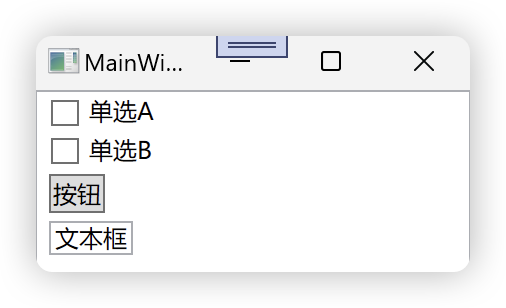

动态数据绑定到ListBox，新建Person类，并将多个Person实例放入List集合

```c#
class Person
{
    public string Id { get; set; }
    public string FirstName { get; set; }
    public string LastName { get; set; }
}
```

```c#
List<Person> persons = new List<Person>()
{
    new Person() {Id = "1", FirstName = "aaa", LastName = "111" },
    new Person() {Id = "2", FirstName = "bbb", LastName = "222" },
    new Person() {Id = "3", FirstName = "ccc", LastName = "333" },
    new Person() {Id = "4", FirstName = "ddd", LastName = "444" }
};
```

```c#
MyListBox.DisplayMemberPath = "FirstName"; // 要显示的值
MyListBox.SelectedValuePath = "Id"; // 取出那个值
MyListBox.ItemsSource = persons; // 绑定的数据对象
```

### HeaderedItemsControl族

- 除了具有ItemsControl类的特性之外，还具有标题
- 内容属性为Items、ItemsSource和Header

## Decorator族

- 用于UI元素的装饰作用
- 内容属性为Child
- 内容元素只能是单一元素

### TextBox和TextBlock

- TextBox中的内容可以被用户编辑。
- TextBlock是静态文本，可以运用格式操作对文字排版。

## Shape族

- 用来装饰UI的元素，它不是控件。
- 该类元素没有自己的内容
- 可以使用Fill属性为他们设置填充效果
- 可以使用Stroke属性来设置边线效果
- 用于2D绘图

### Panel族

- 主要作用是布局UI控件
- 内容属性是Children
- 内容元素可以是多个，并会控制这些内容元素的布局

| 英文                   | 中文           |
| ---------------------- | -------------- |
| Canvas                 | 画布           |
| ToolBarOverflowPanel   | 工具栏溢出面板 |
| TabPanel               | 选项卡面板     |
| VirtualizingPanel      | 虚拟化面板     |
| DockPanel              | 停靠面板       |
| StackPanel             | 堆叠面板       |
| UniformGrid            | 均匀网格       |
| VirtualizingStackPanel | 虚拟化堆叠面板 |
| Grid                   | 网格           |
| ToolBarPanel           | 工具栏面板     |
| WrapPanel              | 自动换行面板   |

### Grid网格布局

- 设置任意数量的行和列
- 行列的高度和宽度可以精确设定，可以设置高度和宽度的最大值和最小值
- 内部元素可以设置其所在的行和列，以及跨行和跨列
- 可以设置内部元素的对其方式

接受的单位

| 英文       | 中文 | 简写             | 换算               |
| ---------- | ---- | ---------------- | ------------------ |
| Pixel      | 像素 | px(默认，可省略) | 计算机图形基本单位 |
| Inch       | 英寸 | in               | 1 in = 96 px       |
| Centimeter | 厘米 | cm               | 1 cm = 96/2.54 px  |
| Point      | 点   | pt               | 1 pt = 96/72 px    |

设置Grid网格的行和列

```xaml
 <Grid>
   	<!--行-->
     <Grid.RowDefinitions>
         <RowDefinition Height="20"/> // 绝对值
         <RowDefinition Height="2*"/> // 比例值
         <RowDefinition Height="Auto"/> // 自动
     </Grid.RowDefinitions>
   	<!--列-->
     <Grid.ColumnDefinitions>
         <ColumnDefinition/>
         <ColumnDefinition/>
         <ColumnDefinition/>
     </Grid.ColumnDefinitions>
</Grid>
```

Grid的高和宽可以设置为三类：

1. 绝对值 ：double数值后面加上单位（px可以省略）
2. 比例值：double后面加上`*`号
3. 自动值：`Auto`字符串

> [!IMPORTANT]
>
> 比例值在double数值后面加上`*`号，解析器会把所有比例值加起来作为分母，把每个比例值作为分子，再用这个比例乘上为占用空间的像素数量，把计算结果作为每个比例值的最终像素。默认比例`1*`可以略写为`*`

Grid的行和列

- 行和列是从0开始计数
- 使用附加属性`Grid.Row=行编号`来指定控件所在的行，如果是在第0行，则可以省略，`Grid.Column=列编号`同理
- 使用`Grid.RowSpan=行数`来设置跨行，使用`Grid.Column=列数`来设置跨列数

使用GridSplitter可以改变Grid的初始设置的行高和列宽

```xaml
 <Grid>
     <Grid.RowDefinitions >
         <RowDefinition Height="30" />
         <RowDefinition />
     </Grid.RowDefinitions>
     <Grid.ColumnDefinitions >
         <ColumnDefinition Width="173" />
         <ColumnDefinition Width="Auto"/>
         <ColumnDefinition/>
     </Grid.ColumnDefinitions>
     <!--跨列 -->
     <TextBox Grid.ColumnSpan="3" BorderBrush="Red" />
     <TextBox Grid.Row="1" BorderBrush="Black" />
     <!--分割线-->
     <GridSplitter Grid.Row="1" 
                   Grid.Column="1" 
                   VerticalAlignment="Stretch" 
                   HorizontalAlignment="Center" 
                   Width="5" 
                   Background="Green" 
                   ShowsPreview="True"/>
     <TextBox Grid.Row="1" Grid.Column="2" BorderBrush="Black" />
 </Grid>
```

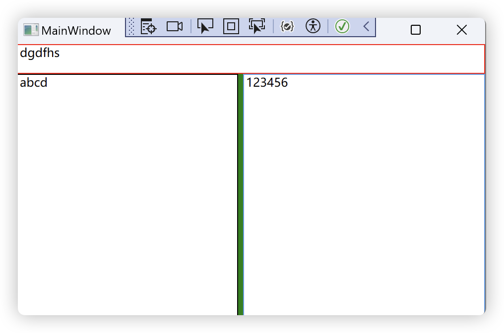

### StackPanel布局

可以使内部元素在水平方向或垂直方向上紧凑布局，如同积木一样，抽掉前面的元素，后面的元素会整体的向前移动补齐原有的位置。

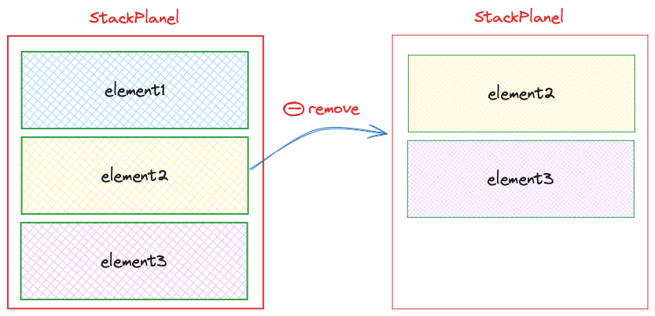

| 属性名              | 数据类型                | 值                                                           | 描述                               |
| ------------------- | ----------------------- | ------------------------------------------------------------ | ---------------------------------- |
| Orientation         | Orientation枚举         | Horizontal <br />Vertical                                    | 决定元素在水平方向还是垂直方向排列 |
| HorizontalAlignment | HorizontalAlignment枚举 | Left<br />Center<br />Right<br />Stretch（会尽可能地扩展<br/>父容器的宽度） | 内部元素在水平方向的对齐方式       |
| VerticalAlignment   | VerticalAlignment枚举   | Top<br />Center<br />Bottom<br />Stretch                     | 内部元素在垂直方向的对齐方式       |

### Canvas画布

当控件被放入Canvas画布中具有附加属性Canvas.Top、Canvas.Bottom、Canvas.Left、Canvas.Right来控制控件的坐标位置。

```xaml
<Canvas>
    <TextBlock Text="用户名：" Canvas.Left="10" Canvas.Top="10"/>
    <TextBox Width="300" Height="20" Canvas.Left="60" Canvas.Top="10"/>
    <TextBlock Text="密码：" Canvas.Left="10" Canvas.Top="40"/>
    <TextBox Width="300" Height="20" Canvas.Left="60" Canvas.Top="40"/>
</Canvas>
```

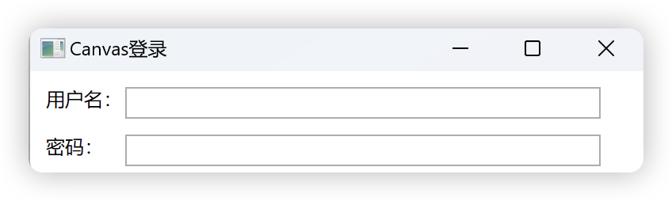

### DockPanel布局

DockPanel内部的元素会附加DockPanel.Dock属性，该属性类型是一个枚举有四个值Left、Right、Top、Bottom。DockPanel内的的元素会按照指定的方向累积，切分内部的剩余可用空间。内部最后一个元素会占据剩余的空间充满。

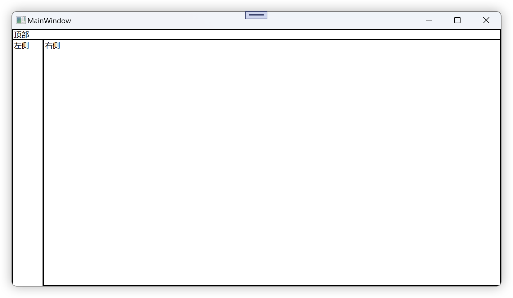

```xaml
<DockPanel >
    <TextBox Text="顶部"  BorderBrush="Black"  DockPanel.Dock="Top" />
    <TextBox Text="左侧" Height="450" Width="50" BorderBrush="Black" DockPanel.Dock="Left" />
    <TextBox Text="右侧" Height="Auto" BorderBrush="Black" />
</DockPanel>
```

### WrapPanel浮动布局

使用WrapPanel的Orientation来控制流延伸的方向，使用HorizontalAlignment和VerticalAlignment两个属性来控制内部控件的对齐方式

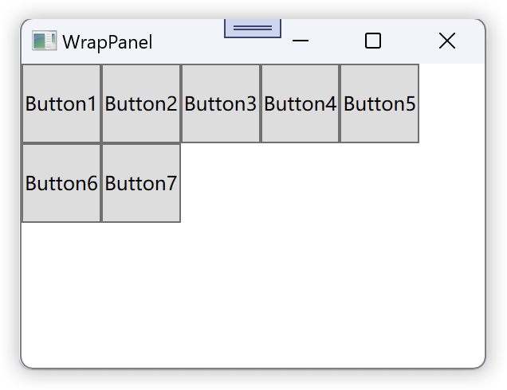

~~~xaml
<WrapPanel Orientation="Horizontal">
    <Button Content="Button1" Height="50" />
    <Button Content="Button2" Height="50" />
    <Button Content="Button3" Height="50" />
    <Button Content="Button4" Height="50" />
    <Button Content="Button5" Height="50" />
    <Button Content="Button6" Height="50" />
    <Button Content="Button7" Height="50" />
</WrapPanel>
~~~

## 数据Binding

### Binding的基础概念

Windows GUI运行的机制是使用消息来驱使程序运行，消息主要来源于用户的操作比如点击按钮按下等，消息会被Windows翻译并送达目标程序然后被程序处理。

在WPF中应用程序一般被分为三层结构：数据存储层、数据处理层、数据展示层。

在WPF中Binding被视为数据和UI的桥梁，它的两端是Binding的源Source和目标Target，数据源就是数据从哪里来，目标就是数据要到哪里去。

> Q:如何属性具备通知Binding值已经变化的能力？
>
> A:在属性的set语句中激发一个`PropertyChanged`事件，让作为数据源的类实现`System.ComponentModel`命名空间中的`INotifyPropertyChanged`接口。当 为Binding设置数据源后，Binding就会自动侦听来自这个接口的`PropertyChanged`事件

绑定示例

```c#
public class Student : INotifyPropertyChanged
{

    public event PropertyChangedEventHandler PropertyChanged;

    private string name;

    public string Name
    {
        get { return name; }
        set
        {
            name = value;
            // 激发事件
            if (this.PropertyChanged != null)
            {
                // Name属性发生改变
                this.PropertyChanged(this, new PropertyChangedEventArgs("Name"));
            }
        }
    }
}
```

~~~xaml
<StackPanel>
    <TextBox x:Name="MyTextBox" BorderBrush="Red" Margin="5" />
    <Button Content="add name" Click="Button_Click" />
</StackPanel>
~~~

~~~c#
public partial class MainWindow : Window
{
    Student stu;
    public MainWindow()
    {
        InitializeComponent();
        // 准备数据源
        stu = new Student();

        // 准备Binding
        Binding binding = new Binding();// 准备一个绑定对象
        binding.Source = stu; // 指定数据源
        binding.Path = new PropertyPath("Name");  // 为绑定指定访问路径

        // 设置Binding的连接源和目标
      	// target:绑定的目标
      	// dp:绑定的数据要传到绑定目标的那个属性
      	// binding:哪个绑定数据源与绑定目标关联起来
        BindingOperations.SetBinding(target:this.MyTextBox, dp:TextBox.TextProperty, binding:binding);
      
      	// 上面的代码使用合在一起,TextBox对BindingOperations.SetBinding(...)进行了封装，同时使用对象初始化语法
        this.MyTextBox.SetBinding(TextBox.TextProperty,new Binding("Name"){Source = new Student()});
    }

    private void Button_Click(object sender, RoutedEventArgs e)
    {
      	// 原有的Name拼接到现有的Name后面
        stu.Name += "NewName";
    }
}
~~~

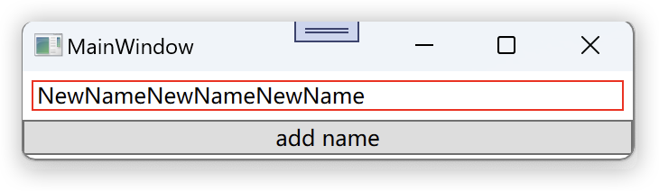

### **Binding的模型**

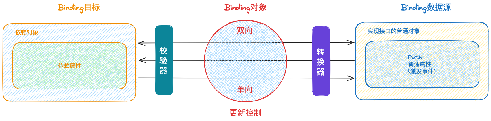

## Banding源与路径

Binding的源只要它是一个对象，并且通过属性公开自己的数据，它就能作为Binding的源。

类实现`INotifyPropertyChanged`接口并在属性的set方法中激发`PropertyChanged`时事件，则该对象就具有自动通知Binding自己的属性值已经变化的能力。

### 控件作为Binding源与Binding标记扩展

使用Binding在控件建立关联，让UI元素产生联动效果

~~~xaml
<StackPanel>
  	<!--textBox1的Text属性设置Binding为Value-->
    <TextBox x:Name="textBox1" Text="{Binding Path=Value,ElementName=slider1}" BorderBrush="Black" />
    <Slider x:Name="slider1" Minimum="0" Maximum="100" />
</StackPanel>
~~~

运行结果

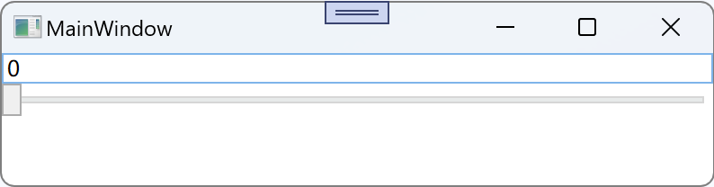

Binding类的构造器

~~~c#
// Binding的构造方法
public Binding(string path)
{
    if (path != null)
    {
        if (Dispatcher.CurrentDispatcher == null)
        {
            throw new InvalidOperationException();
        }

        Path = new PropertyPath(path, (object[])null);
    }
}
~~~

上面的xaml代码可以简写为

~~~xaml
 <TextBox x:Name="textBox1" Text="{Binding Path=Value,ElementName=slider1}" BorderBrush="Black" />
 简写后
 <TextBox x:Name="textBox1" Text="{Binding Value,ElementName=slider1}" BorderBrush="Black" />
~~~

等价于c#代码

```c#
this.textBox1.SetBinding(TextBox.TextProperty,
                         new Binding("Value"){ElementName=slider1}
                        );
```

### Binding的方向和数据更新

Binding数据的流向的属性`Mode`它是BindingMode枚举类型

| BindingMode的可选值 |                             作用                             |
| :-----------------: | :----------------------------------------------------------: |
|       TwoWay        | 这是双向绑定。当源属性或目标属性中的任何一个发生更改时，另一个也会更新 |
|       OneWay        | 当源属性发生更改时，目标属性会更新。<br/>但是，如果目标属性的值发生更改，它不会反馈到源属性 |
|       OneTime       | 在绑定创建时，目标属性会根据源属性的当前值进行设置。<br/>之后，如果源属性发生变化，目标属性不会更新 |
|   OneWayToSource    | 与OneWay相反，当目标属性发生更改时，源属性会更新。<br/>但是，如果源属性的值发生更改，它不会更新目标属性 |
|       Default       | 这个模式的行为取决于源或目标对象是否支持特定的绑定模式。<br/>例如，如果源属性有`set`访问器，那么它可能默认为TwoWay绑定，<br/>否则可能默认为OneWay绑定。 |

~~~xaml
<StackPanel VerticalAlignment="Center" Background="#FFF5F7F5" >
    <TextBox x:Name="textbox1" Width="200" Margin="10"/>
    <Slider x:Name="slider1" Width="200" Minimum="0" Maximum="100" Value="{Binding Path=Text, 						ElementName=textbox1}" BorderBrush="Black"/>
</StackPanel>
~~~


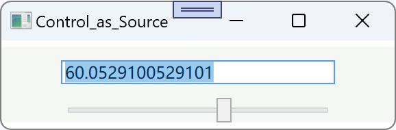

### Binding的Path属性

可以使用`.`符号来访问多级路径

~~~xaml
<StackPanel VerticalAlignment="Center">
    <TextBox x:Name="textBox1" Width="400" />
    <TextBlock Text="{Binding Path=Text.Length,ElementName=textBox1,Mode=OneWay}" Margin="0 10 10 0" Width="400"/>
</StackPanel>
~~~


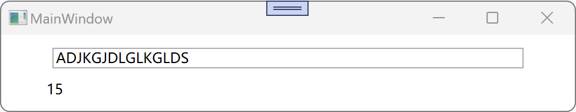

使用索引器来访问

~~~xaml
<StackPanel VerticalAlignment="Center">
    <TextBox x:Name="textBox1" Width="400" />
    <TextBlock Text="{Binding Path=Text.[3],ElementName=textBox1,Mode=OneWay}" Margin="0 10 10 0" Width="400"/>
</StackPanel>
~~~


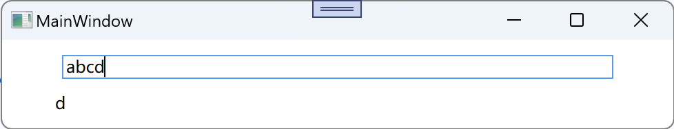

集合类或者DataView的对象可以使用`/`来访问

~~~xaml
<Grid>
    <Grid.RowDefinitions>
        <RowDefinition/>
        <RowDefinition/>
        <RowDefinition/>
    </Grid.RowDefinitions>
    <TextBox x:Name="box1" Grid.Row="0" Height="30"/>
    <TextBox x:Name="box2" Grid.Row="1" Height="30"/>
    <TextBox x:Name="box3" Grid.Row="2" Height="30"/>
</Grid>
~~~

~~~c#
List<string> list = new List<string>(){ "Hello", "Ni","Hao"};
box1.SetBinding(TextBox.TextProperty, new Binding("/") { Source = list });// 集合中的第一元素
box2.SetBinding(TextBox.TextProperty, new Binding("/Length") { Source = list ,Mode = BindingMode.OneWay});
box3.SetBinding(TextBox.TextProperty, new Binding("/[2]") { Source = list ,Mode = BindingMode.OneWay});
~~~

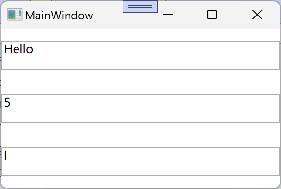

元素的属性是一个集合时，可以多级的`/`来访问

### 不需要指定Path的Binding

比如基本类型string、int等基本类型。在`xaml`中`.`可以被省略，但是在C#代码中不能省略

~~~xaml
<StackPanel>
   <StackPanel.Resources>
       <sys:String x:Key="mystr">
           这是在xaml中的文字
       </sys:String>
   </StackPanel.Resources>
   <TextBlock x:Name="text1" Text="{Binding Path=., Source={StaticResource mystr}}" FontSize="10" Margin="5" />
   <TextBlock x:Name="text2"  FontSize="10" Margin="5" />
</StackPanel>
~~~

~~~c#
string str = "这是在c#代码中的文字";
// path的点不能省略
text2.SetBinding(TextBlock.TextProperty, new Binding(path: ".") { Source = str });
~~~

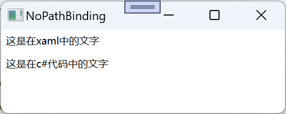

### 没有source的Binding

所有的WPF控件都继承自FrameworkElement，每一个控件都有DataContext。当Binding只知道Path而不知道Source时，会在UI树中向上查找，如果存在则把这个对象作为自己的Source，如果没有则没有数据。

~~~xaml
 <StackPanel >
     <StackPanel.DataContext>
         <local:Car Name="奔驰" Color="红色"/>
     </StackPanel.DataContext>
     <Grid>
         <StackPanel>
             <TextBlock x:Name="textbox1" Text="{Binding Name}"/>
             <TextBlock x:Name="textbox2" Text="{Binding Color}"/>
         </StackPanel>
     </Grid>
 </StackPanel>
~~~

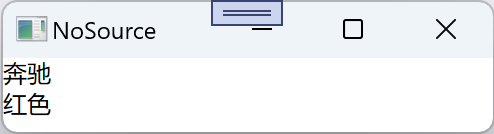

#### DataContext的借用

DataContext是一个依赖属性，当自己没有时则会把自己容器的属性值接过来当做自己的属性值。

~~~xaml
<Grid DataContext="123">
    <Grid>
        <Grid>
            <Button x:Name="btn" Content="按钮" Click="OnClick" Width="50" Height="50"/>
        </Grid>
    </Grid>
</Grid>
~~~

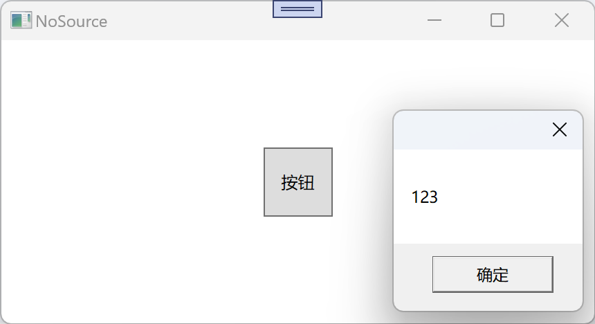

### 使用集合对象作为列表控件的ItemSource

~~~xaml
<StackPanel>
   <TextBlock Text="Student ID:" Margin="5 0 5 0" Height="20"/>
   <TextBox x:Name="stId" Margin="5 0 5 0" Height="20"/>
   <TextBlock Text="Student List:" Margin="5 0 5 0" Height="20"/>
   <ListBox x:Name="listBox1" Margin="5 0 5 5" Height="150"/>
</StackPanel>
~~~

~~~c#
List<Student> students = new List<Student>() 
{
    new Student() { Id = 1 , Name = "xiaoming" , Age = 18 },
    new Student() { Id = 2 , Name = "peiqi", Age = 8},
    new Student() { Id = 3 , Name = "aixi" ,Age =  22 },
    new Student() { Id = 4 , Name = "lilan",Age = 23 },
};

// 为listBox设置binding
listBox1.ItemsSource = students;
// 设置listBox的数据路径
listBox1.DisplayMemberPath = "Name"; 

// 为textBox设置Binding
stId.SetBinding(TextBox.TextProperty, new Binding("SelectedItem.Id") { Source = listBox1 });
~~~

运行效果

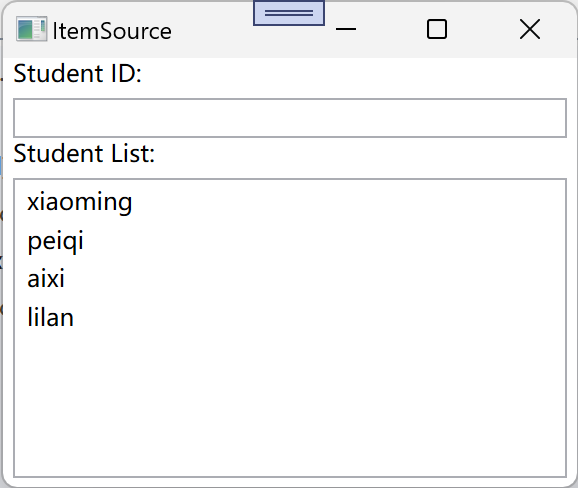

为student类型定制的listBoxt的binding

~~~xaml
<StackPanel>
    <TextBlock Text="Student ID:" Margin="5 0 5 0" Height="20"/>
    <TextBox x:Name="stId" Margin="5 0 5 0" Height="20"/>
    <TextBlock Text="Student List:" Margin="5 0 5 0" Height="20"/>
    <ListBox x:Name="listBox1" Margin="5 0 5 5" Height="150">
        <ListBox.ItemTemplate>
            <DataTemplate>
                <StackPanel Orientation="Horizontal">
                    <TextBlock Text="{Binding Path=Id}" Width="30" />
                    <TextBlock Text="{Binding Path=Name }" Width="60" />
                    <TextBlock Text="{Binding Path=Age }" Width="30" />
                </StackPanel>
            </DataTemplate>
        </ListBox.ItemTemplate>
    </ListBox>
</StackPanel>
~~~

运行效果

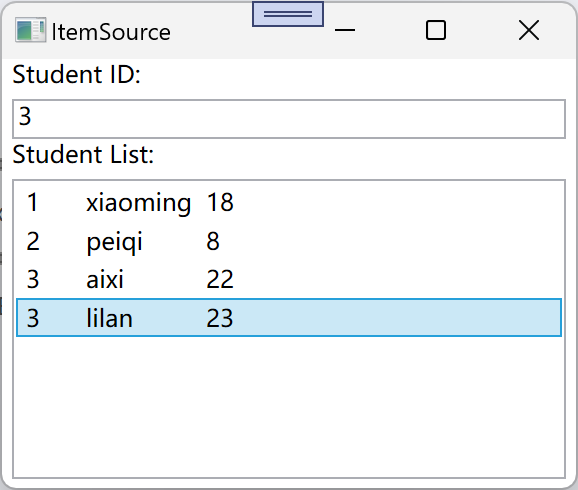

### 使用ADO.NET对象作为Binding的源

> [!NOTE]
>
> ADO.NET（ActiveX Data Objects .NET）是由Microsoft开发的用于在C＃、VB.NET和F＃等基于.NET Framework的语言中访问各种数据源的API。它提供了一种标准化的方式来与数据库交互，无论这些数据库是在本地服务器上还是远程。
>
> ADO.NET有几个关键组件：
>
> - 连接对象：负责管理与数据源之间的通信。
> - 命令对象：用于向数据源发送SQL语句或存储过程。
> - 数据适配器对象：用于将命令对象的结果转换为在应用程序中使用的格式。
> - 数据集对象：包含一个连接到特定数据库的多个表的集合。

~~~xaml
<StackPanel>
   <ListBox x:Name="listbox1" Height="150" Margin="5" />
   <Button x:Name="LoadBtn" Content="Load" Margin="5" Click="Btn_Click" />
</StackPanel>
~~~

~~~c#
private void Btn_Click(object sender, RoutedEventArgs e)
{
    // 创建数据表
    DataTable dt = new DataTable("MyTable");
    // 定义列
    dt.Columns.Add("Id", typeof(int));
    dt.Columns.Add("Name", typeof(string));
    dt.Columns.Add("Age", typeof(int));
    //定义行
    dt.Rows.Add(1, "Tim", 20);
    dt.Rows.Add(2, "Tom", 21);
    dt.Rows.Add(3, "Tony", 27);
    dt.Rows.Add(4, "Jack", 25);

    listbox1.DisplayMemberPath = "Name";
    listbox1.ItemsSource = dt.DefaultView;
}
~~~

运行效果

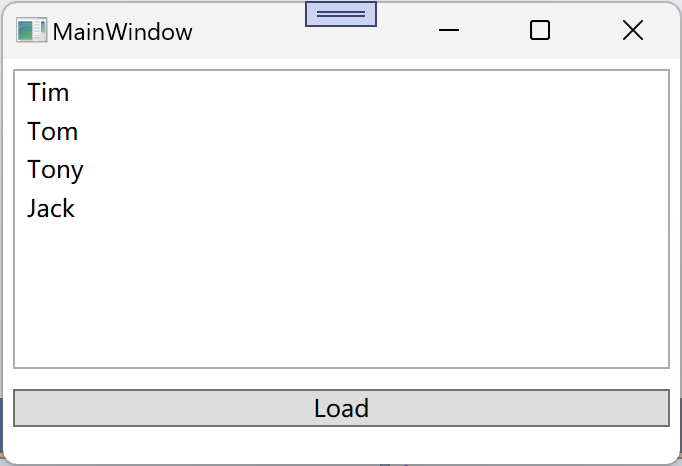

将listBox替换为ListView

~~~xaml
<StackPanel Width="400">
    <ListView x:Name="listView1" Height="150" Margin="5" HorizontalContentAlignment="Right">
        <ListView.View>
            <GridView >
                <GridViewColumn Header="Id" Width="60" DisplayMemberBinding="{Binding Path = Id}"/>
                <GridViewColumn Header="Name" Width="60" DisplayMemberBinding="{Binding Path = Name}"/>
                <GridViewColumn Header="Age" Width="60" DisplayMemberBinding="{Binding Path = Age}"/>
            </GridView>
        </ListView.View>
    </ListView>
    <Button x:Name="LoadBtn" Content="Load" Margin="5" Click="Btn_Click" />
</StackPanel>
~~~

运行效果

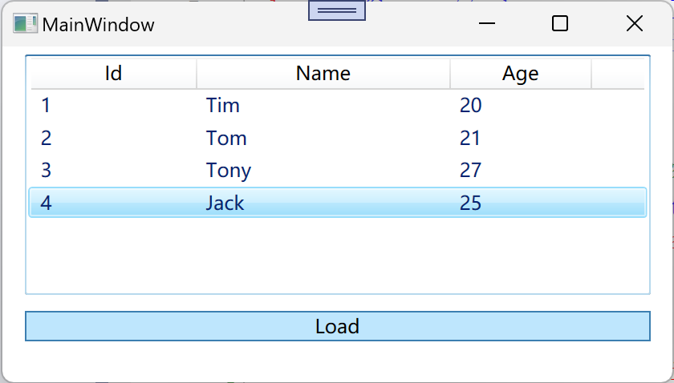

### 使用Xml数据作为Binding的源

NET Framework提供了两套处理XML数据的类库：

- 符合 **DOM** （Document Object Modle，文档对象模型）标准的类库：包括XmlDocument、XmlElement、XmlNode、XmlAttribute等类。这套类库的特点是中规中矩、功能强大，但也背负了太多XML的传统和复杂。
- 以 **LINQ**（Language- Integrated Query成查询）为基础的类库：包括XDocument、XElement、XNode、XAttribute等类。这套类库的特点是可以使用LINQ进行查询和操作，方便快捷。

XML文本是树形结构的，所以XML可以方便地用于表示线性集合（如Array、List等）和树形结构数据。当使用XML数据作为Binding的Source时我们将使用**XPath**属性而不是Path属性来指定数据的来源。

~~~xaml
<StackPanel Width="400">
    <ListView x:Name="listView1" Height="150" Margin="5" HorizontalContentAlignment="Right">
        <ListView.View>
            <GridView >
                <!--@表示XML的属性，不加@符号是XML的子元素,使用XPath路径-->
                <GridViewColumn Header="Id" Width="60" DisplayMemberBinding="{Binding XPath = @id}"/>
                <GridViewColumn Header="Name" Width="60" DisplayMemberBinding="{Binding XPath = Name}"/>
            </GridView>
        </ListView.View>
    </ListView>
    <Button x:Name="LoadBtn" Content="Load" Margin="5" Click="Btn_Click" />
</StackPanel>
~~~

~~~xml
<?xml version="1.0" encoding="utf-8" ?>
<StudentList>
	<Student id="1">
		<Name>Tim</Name>
	</Student>
	<Student id="2">
		<Name>Tom</Name>
	</Student>
	<Student id="3">
		<Name>Vina</Name>
	</Student>
	<Student id="4">
		<Name>Emily</Name>
	</Student>
</StudentList>
~~~

~~~c#
private void Btn_Click(object sender, RoutedEventArgs e)
{
    // 加载XML文件
    XmlDocument xmlDocument = new XmlDocument();
    xmlDocument.Load(@"C:\Users\min\source\repos\ADObinding\XMLFile1.xml");

    // 创建xml数据提供者的实例
    XmlDataProvider xmlDataProvider = new XmlDataProvider();
    xmlDataProvider.Document = xmlDocument;

    xmlDataProvider.XPath = @"/StudentList/Student";
    listView1.DataContext = xmlDataProvider;
    listView1.SetBinding(ListView.ItemsSourceProperty, new Binding());
}
~~~

运行效果

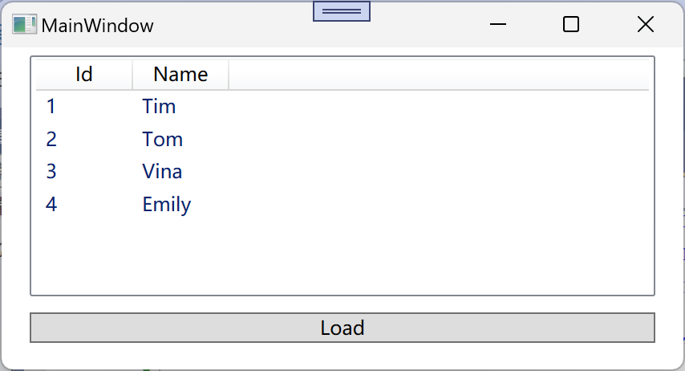

### 使用LinQ检结果作为Binding的源

LinQ(Language-Integrated Query,语言集成查询)，LinQ的查询结果是IEnumerable<T>类型的对象，IEnumerable<T>派生自IEnumerable,它可以做为控件的ItemsSource来使用。

~~~xaml
<StackPanel>
    <ListView x:Name="myListView" Margin="5" Height="200">
        <ListView.View>
            <GridView>
                <GridViewColumn Header="ID" Width="60" DisplayMemberBinding="{Binding Id}"/>
                <GridViewColumn Header="Name" Width="60" DisplayMemberBinding="{Binding Name}"/>
                <GridViewColumn Header="Age" Width="60" DisplayMemberBinding="{Binding Age}"/>
            </GridView>
        </ListView.View>
    </ListView>
    <Button x:Name="LoadBtn" Content="Load" Click="LoadBtn_Click" />
</StackPanel>
~~~

~~~c#
private void LoadBtn_Click(object sender, RoutedEventArgs e)
{
   List<Student> students = new List<Student>();
   students.Add(new Student(1, "Tinner", 12));
   students.Add(new Student(2, "Boob", 15));
   students.Add(new Student(3, "Cary", 19));
   students.Add(new Student(4, "Tim", 14));
   students.Add(new Student(5, "Tom", 13));
	 
   // 查询名字开头带T的学生
   myListView.ItemsSource = from student in students where student.Name.StartsWith("T")  select student;

}
~~~


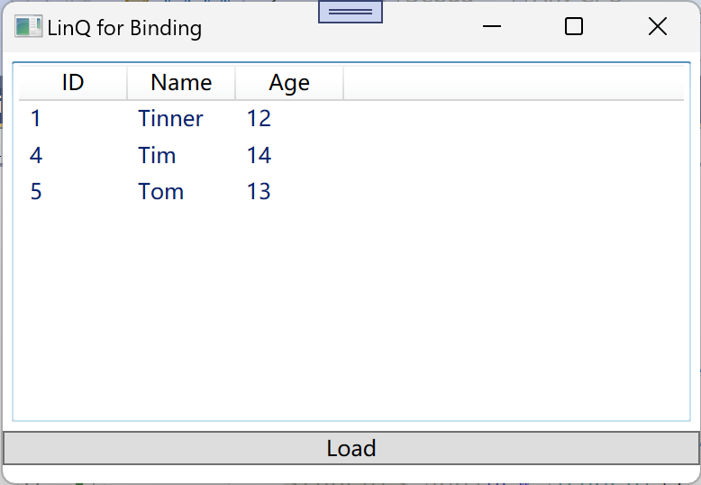

### 使用ObjectDataProvider作为Binding的源

ObjectDataProvider把对象作为数据源给Binding。

~~~c#
class MyCalculator
{
    public string Add(string num1,string num2)
    {
        if (string.IsNullOrEmpty(num1) || string.IsNullOrEmpty(num2))  return string.Empty;
        return (int.Parse(num1) + int.Parse(num2)).ToString();
    }
}
~~~

~~~xaml
<StackPanel>
  <TextBlock Text="Param1" Margin="5" />
  <TextBox x:Name="textbox1" Margin="5" />
  <TextBlock Text="Param2" Margin="5" />
  <TextBox x:Name="textbox2" Margin="5" />
  <TextBlock Text="Result" Margin="5" />
  <TextBox x:Name="result" Margin="5" />
</StackPanel>
~~~

~~~c#
private void SetBinding()
{
    // 创建ObjectDataProvider
    ObjectDataProvider provider = new ObjectDataProvider();
    // 设置用作binding源对象
    provider.ObjectInstance = new MyCalculator();
    provider.MethodName = "Add";
    provider.MethodParameters.Add("0");
    provider.MethodParameters.Add("0");

    // 将创建ObjectDataProvider作为source,创建Binding
    Binding bindingToParam1 = new Binding("MethodParameters[0]")
    {
        Source = provider,
        BindsDirectlyToSource = true,// 相对于数据项目本身为false,否则为true
        UpdateSourceTrigger = UpdateSourceTrigger.PropertyChanged
    };

    // 将创建ObjectDataProvider作为source,创建Binding
    Binding bindingToParam2 = new Binding("MethodParameters[1]")
    {
        Source = provider,
        BindsDirectlyToSource = true,// 相对于数据项目本身为false,否则为true
        UpdateSourceTrigger = UpdateSourceTrigger.PropertyChanged
    };

    // 将创建ObjectDataProvider作为source,创建Binding
    Binding bindingToResult = new Binding(".") { Source = provider };

    // 将Binding对象与UI对象绑定
    this.textbox1.SetBinding(TextBox.TextProperty, bindingToParam1);
    this.textbox2.SetBinding(TextBox.TextProperty, bindingToParam2);
    this.result.SetBinding(TextBox.TextProperty, bindingToResult);
}
~~~


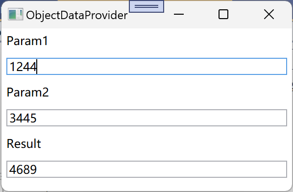

### 使用Binding的RelateiveSource

不确定作为Binding的Source的对象叫什么，但是知道它与作为Binding目标对象在UI布局上的相对关系时，例如控件关联自己的某个属性、或者关联自己的某级容器的数据。就可以使用RelateiveSource。

示例代码：

TextBlock的Text属性内容设置为父级的Grid的Name属性

~~~xaml
<Grid x:Name="g1">
    <DockPanel x:Name="d1" Margin="5" Background="red" >
        <Grid x:Name="g2" Margin="10" Background="Blue" >
            <DockPanel x:Name="d2" Margin="10" Background="Yellow">
                <TextBlock x:Name="MyTextBlock" Margin="10" FontSize="30" Width="Auto"/>
            </DockPanel>
        </Grid>
    </DockPanel>
</Grid>
~~~

~~~c#
public MainWindow()
{
    InitializeComponent();

    // 创建相对资源对象，RelativeSourceMode如果为Self则表示自身
    RelativeSource rs = new RelativeSource(RelativeSourceMode.FindAncestor);
  	// ncestorLevel 属性用于指定相对源应该搜索多少级别向上遍历其祖先对象。
    rs.AncestorLevel = 1;
  	// 不是Grid类型的会被略过
    rs.AncestorType = typeof(Grid);
    Binding binding = new Binding("Name") { RelativeSource = rs };
    this.MyTextBlock.SetBinding(TextBlock.TextProperty, binding);
}


对应的Xaml代码
<TextBlock x:Name="MyTextBlock"
Text="{Binding Path=Name, RelativeSource={RelativeSource Mode=FindAncestor,AncestorType={x:Type Grid}}}" 
~~~

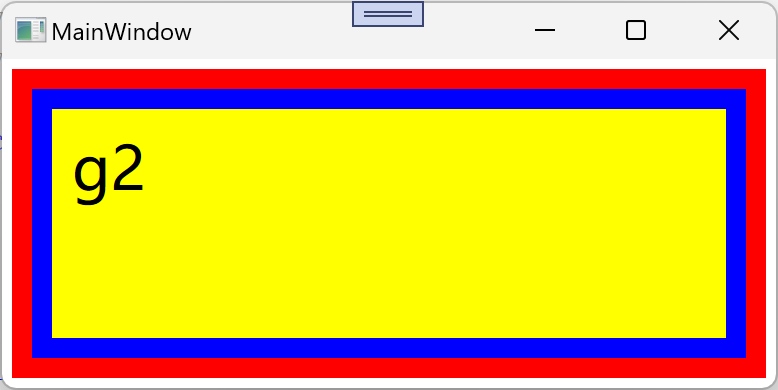

## Binding对数据校验和转换

Binding是目标Target与Source之间的桥梁，Binding进行数据的**校验**是`ValidationRules`属性，对数据的**转换**是`Converter`属性

### 数据Binding的校验

通过实现ValidationRules类并实现Validate方法，Validate的方法返回值是ValidationResult类型的对象。如果校验通过，则将ValidationResult对象的IsValid属性设置为true,校验不通过则将IsValid属性设为false，并ErrorContet属性设为一个合适的消息内容。

~~~xaml
<StackPanel VerticalAlignment="Center">
    <TextBox x:Name="myBox" Margin="5" />
    <Slider x:Name="mySlider" Maximum="110" Minimum="-10" Margin="5" />
</StackPanel>
~~~

当数据验证失败时，设置 `NotifyOnValidationError` 属性为 true 将使绑定对象像警报一样发出信号，这个信号从目标开始在 UI 元素树上向下传播，每到达一个节点，如果该节点上有处理这种信号的监听器（事件处理程序），则触发监听器以处理信号。信号处理完成后，开发人员可以选择让信号继续向下传播还是停止，这就是路由事件，信号在 UI 元素树上的传递过程被称为路由（Route）。

~~~c#
public MainWindow()
{
    InitializeComponent();
    Binding binding = new Binding("Value") { Source = this.mySlider };
    binding.UpdateSourceTrigger = UpdateSourceTrigger.PropertyChanged;
    RangeValidationRule rule = new RangeValidationRule();
    // 对绑定的目标也进行校验,默认只在Target更新时校验
    rule.ValidatesOnTargetUpdated  = true;
    binding.ValidationRules.Add(rule);
    binding.NotifyOnValidationError = true; // 验证错误时触发
    myBox.SetBinding(TextBox.TextProperty, binding);
	
  	// 添加路由事件
    this.myBox.AddHandler(Validation.ErrorEvent, new RoutedEventHandler(this.ValidationError));
}

void ValidationError(object obj, RoutedEventArgs e)
{   
    // Error条目大于0时
    if (Validation.GetErrors(this.myBox).Count > 0)
    {
      	// 提示信息
        this.myBox.ToolTip = Validation.GetErrors(this.myBox)[0].ErrorContent.ToString();
    }
}
~~~

~~~c#
class RangeValidationRule : ValidationRule
{
   public override ValidationResult Validate(object value, CultureInfo cultureInfo)
   {
       double d = 0;
       if (double.TryParse(value.ToString(),out d))
       {
           if (d>=0 && d<=100)
           {
               return new ValidationResult(true, null);
           }
       }

       return new ValidationResult(false, "验证失败");
   }
}
~~~

运行效果

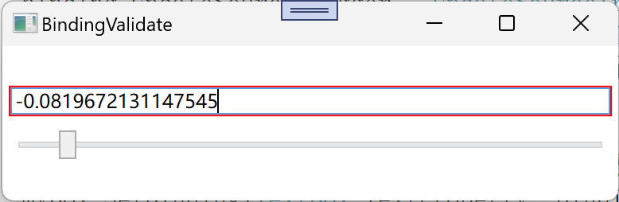

### Binding的数据转换

手动实现IValueConverter接口，并实现Convert方法和ConvertBack方法.

- 当数据从Binding的Source流向Target时会调用Convert方法；

- 当数据从Target流向Source时，ConvertBack方法会被调用。

~~~c#
namespace System.Windows.Data
{
  	// IValueConverter接口
    public interface IValueConverter
    {
        object Convert(object value, Type targetType, object parameter, CultureInfo culture);

        object ConvertBack(object value, Type targetType, object parameter, CultureInfo culture);
    }
}
~~~

~~~xaml
<Window.Resources>
    <local:CategoryToSourceConverter x:Key="cts" />
    <local:StateToNullableBoolConverter x:Key="stnb" />
</Window.Resources>
<StackPanel Background="Blue">
    <ListBox x:Name="listBoxPlane" Height="160" Margin="5">
        <ListBox.ItemTemplate>
            <DataTemplate>
                <StackPanel Orientation="Horizontal">
                  <!--Category会被转化为路径-->
                    <Image Width="20" Height="20" Source="{Binding Path=Category, Converter={StaticResource cts}}" />
                        <TextBlock Text="{Binding Path=Name}" Width="60" Margin="80,0" />
                  <!--是否选中会和State转化-->
                    <CheckBox IsThreeState="True" IsChecked="{Binding Path=State, Converter={StaticResource stnb}}" />
                </StackPanel>
            </DataTemplate>
        </ListBox.ItemTemplate>
    </ListBox>
    <Button x:Name="buttonLoad" Content="Load" Height="25" Margin="5,0" Click="buttonLoad_Click" />
    <Button x:Name="buttonSave" Content="Save" Height="25" Margin="5,0" Click="buttonSave_Click" />
</StackPanel>
~~~

~~~c#
namespace BindingConvert
{
    public enum Category
    {
        Bomber,
        Fighter
    }

    public enum State
    {
        Available,
        Locked,
        Unknown
    }

    public class Plane
    {
        public Category Category { get; set; }
        public string Name { get; set; }
        public State State { get; set; }
    }
}
~~~

~~~c#
namespace BindingConvert
{
    public class CategoryToSourceConverter : IValueConverter
    {
      	// 将Category转为Image可用的Uri
        public object Convert(object value, Type targetType, object parameter, CultureInfo culture)
        {
            Category ca = (Category)value;
            switch (ca)
            {
                case Category.Bomber:
                    return @"\Icons\Bomber.png";
                case Category.Fighter:
                    return @"\Icons\Fighter.png";
                default:
                    return null;
            }
        }

        public object ConvertBack(object value, Type targetType, object parameter, CultureInfo culture)
        {
            throw new NotImplementedException();
        }
    }
}

~~~

~~~c#
namespace BindingConvert
{
    public class StateToNullableBoolConverter : IValueConverter
    {
      	// 将State转为Bool?
        public object Convert(object value, Type targetType, object parameter, CultureInfo culture)
        {
            State s = (State)value;
            switch (s)
            {
                case State.Locked:
                    {
                        return false;
                    }
                case State.Available:
                    {
                        return true;
                    }
                case State.Unknown:

                default:
                    {
                        return null;
                    }
            }
        }
				
      	// Bool?转为State
        public object ConvertBack(object value, Type targetType, object parameter, CultureInfo culture)
        {
            bool? nb = (bool?)value;
            switch (nb)
            {
                case true:
                    {
                        return State.Available;
                    }
                case false:
                    {
                        return State.Locked;
                    }
                case null:
                default:
                    {
                        return State.Unknown;
                    }
            }
        }
    }
}
~~~

~~~c#
private void buttonLoad_Click(object sender, RoutedEventArgs e)
{
   List<Plane> planeList = new List<Plane>()
   {
       new Plane(){Category=Category.Bomber, Name="B-1", State=State.Unknown},
       new Plane(){Category=Category.Bomber, Name="B-2", State=State.Unknown},
       new Plane(){Category=Category.Fighter, Name="F-22", State=State.Unknown},
       new Plane(){Category=Category.Fighter, Name="Su-47", State=State.Unknown},
       new Plane(){Category=Category.Bomber, Name="B-52", State=State.Unknown},
       new Plane(){Category=Category.Fighter, Name="J-10", State=State.Unknown}
   };

   listBoxPlane.ItemsSource = planeList;
}

private void buttonSave_Click(object sender, RoutedEventArgs e)
{
   StringBuilder sb = new StringBuilder();
   foreach (Plane p in listBoxPlane.Items)
   {
       sb.AppendLine(string.Format("Category={0}, Name={1}, State={2}", p.Category, p.Name, p.State));
   }
   File.WriteAllText(@"C:\Users\min\source\repos\BindingConvert\PlaneList.txt", sb.ToString());
}
~~~

~~~txt
Category=Bomber, Name=B-1, State=Locked
Category=Bomber, Name=B-2, State=Available
Category=Fighter, Name=F-22, State=Available
Category=Fighter, Name=Su-47, State=Available
Category=Bomber, Name=B-52, State=Unknown
Category=Fighter, Name=J-10, State=Unknown
~~~

运行结果

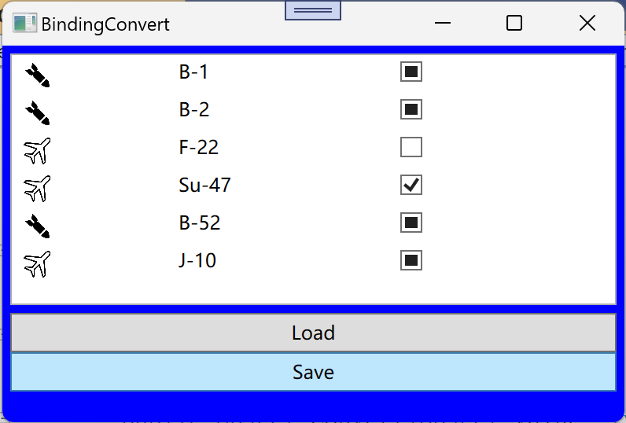
